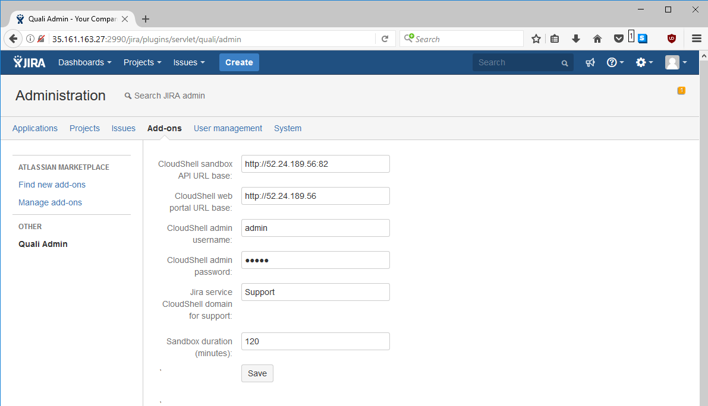

# Jira-Integration

## Health check example

End-to-end demo 

Summary:
- Reserve the Jira Automatic Health Check or Jira Health Check blueprint
- If using Jira Health Check, run the sandbox command Run Health Checks. If using Jira Automatic Health Check, the health checks will be run automatically during Setup.
- DUT 2 will fail its health check
- End the sandbox
- Teardown calls the Jira error handler because the service is present in the reservation
  - A Jira issue is automatically opened
  - The resource is automatically removed from the reservation and moved to the "Support" domain
  - A link to the Jira issue is printed in the Output window and Activity feed
- On the Jira issue page, click "Open in Quali CloudShell" in the top right
- A new sandbox will be started by the Jira plugin
- The problematic resource is added to the sandbox
- This sandbox can be used to launch a connection to the resource and troubleshoot it
- A Jira service is also available in the sandbox with the command "Close issue" that automatically closes the Jira issue and moves the resource back from the Support domain to its original domains

Details:

## Components

### Jira Service

A CloudShell service that represents a Jira endpoint.

The service stores the endpoint URL and credentials and supports a few functions that call the Jira REST API. One function is a standard error handler so Jira can be used the pluggable issue tracker in sandboxes.

### Quali plugin for Jira

Adds a command to the Jira issue page: More>Open in Quali CloudShell

This connects to the CloudShell sandbox API to reserve a Jira worker blueprint and run a function that in turn creates a debug sandbox containing the resource referenced by the Jira issue. The link to the debug sandbox (in the Support domain) 

## Development
- Jira plugin (Java)
  - SDK
    - Windows
      - Install JDK 8, ensure javac.exe is in PATH
      - Install Jira plugin SDK https://developer.atlassian.com/docs/getting-started/set-up-the-atlassian-plugin-sdk-and-build-a-project
      - Fix PATH and JAVA_HOME in Windows system properties if they were set incorrectly by the Jira SDK
      - In Git Bash:
        - git clone https://github.com/QualiSystemsLab/Jira-Integration.git
        - cd Jira-Integration
    - Ubuntu 16
      - apt-get update
      - apt-get install openjdk-8-jdk
      - export JAVA_HOME=/usr/lib/jvm/java-8-openjdk-amd64
      - sh -c 'echo "deb https://sdkrepo.atlassian.com/debian/ stable contrib" >>/etc/apt/sources.list'
      - apt-key adv --keyserver hkp://keyserver.ubuntu.com:80 --recv-keys B07804338C015B73
      - apt-get install apt-transport-https
      - apt-get update
      - apt-get install atlassian-plugin-sdk
      - atlas-version
      - git clone https://github.com/QualiSystemsLab/Jira-Integration.git
      - cd Jira-Integration/
  - Run Jira server in one command prompt:
    - cd QualiJiraPlugin
    - atlas-run
    - Leave open
    - Press Ctrl+C to shut down -- note that it uses an in-memory database so all user data will be lost when exiting
  - In another command prompt, reload the plugin every time the code is changed:
    - cd QualiJiraPlugin
    - atlas-mvn package
- CloudShell package
  - Double click build.cmd
  - In non-Support domain, drag Jira Service Package.zip into the portal
  - In Support domain, drag Jira Service Domain Package.zip into the portal
  - To update:
	- In Git Bash: git clone https://github.com/QualiSystemsLab/Jira-Integration.git
	- Edit files
	- Double click build.cmd
  - When adding a Jira Error Handler Service to your blueprint, update the password and URL to match any Jira account

## Functions provided

### Jira Action Service
- jira_add_comment_to_issue
    - COMMENT - text of the comment
    - (issue id will be taken from the sandbox name, e.g. DUT 1 debug sandbox - issue 10001)
- jira_close_issue - executes the transition to Done on the Jira issue
    - COMMENT - a comment to describe the resolution of the ticket
    - (issue id will be taken from the sandbox name, e.g. DUT 1 debug sandbox - issue 10001)

### Jira Error Handler Service
- jira_error_handler - (run by Error Handler Sandbox Teardown) check all sandbox resources for a pattern such as 'Error' in the live status, as set by health_check; for each resource with a problem, create a Jira issue and quarantine the resource by moving it to the domain specified in Support Domain
